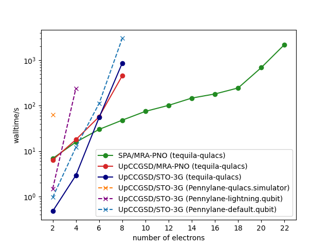

A small benchmark showcasing current VQE methods implemented in [tequila](https://github.com/tequilahub/tequila).  
Timings from Intel(R) Xeon(R) W-2135 CPU @ 3.70GHz with Ubuntu.  

## Note on the methods  

### SPA/MRA-PNO and UpCCGSD/MRA-PNO
- computed with [spa_tq.py](script_spa.py)  
- described in [arxiv:2105.03836](https://arxiv.org/abs/2105.03836)  
- SPA/MRA-PNO uses HCB encoding (leads to identical energy but saves qubit and measurement resources)  
- Factorized form of SPA is not exploited in implementation (exponential bottleneck of full qubit simulation kicks in after 18 electrons)  
- uses MRA-PNOs via the madness interface (described in [arxiv:2008.02819](https://arxiv.org/abs/2008.02819)). In the beginning the increased runtime (compated to UpCCGSD/STO-3G) is due to the orbital determination.  
- install madness interface with `conda install madtequila -c kottmann` (only linux)  
- qubit count: UpCCGSD qubits=2x(N-Electrons), SPA qubits=N-Electrons  

### UpCCGSD/STO-3G
- computed with [upccgsd_tq.py](script_upccgsd.py)  
- described in [arxiv:2105.03836](https://arxiv.org/abs/2105.03836)  
- qubit count: qubits=2x(N-Electrons)

### UpCCGSD/STO-3G (Pennylane)
Pennylane timings (see [pl.py](pl.py)) are included as a representative for state-of-the-art code with industry standard.  
