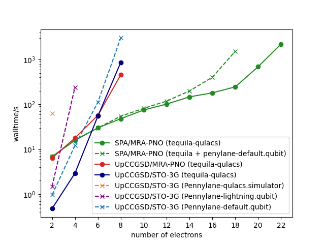

# Out-Of-The-Box VQEs

A small benchmark showcasing an out-of-the-box VQE with methods implemented in [tequila](https://github.com/tequilahub/tequila).  
**The scenario is: I want to run an electronic VQE, how far do I get without manually tweaking code or parameters.**  

Note that this is not a propper benchmark. The intent is to provide some ballpark estimates on walltimes to expect with the displayed methods.  


Timings from Intel(R) Xeon(R) W-2135 CPU @ 3.70GHz with Ubuntu.  

## Note on the methods  

### SPA/MRA-PNO and UpCCGSD/MRA-PNO
- computed with [spa_tq.py](script_spa.py)  
- code taken from examples in [arxiv:2105.03836](https://arxiv.org/abs/2105.03836)  
- SPA/MRA-PNO uses HCB encoding (leads to identical energy but saves qubit and measurement resources)  
- Factorized form of SPA is not exploited in implementation (exponential bottleneck of full qubit simulation kicks in after 18 electrons)  
- uses MRA-PNOs via the madness interface (described in [arxiv:2008.02819](https://arxiv.org/abs/2008.02819)). In the beginning the increased runtime (compated to UpCCGSD/STO-3G) is due to the orbital determination.  
- install madness interface with `conda install madtequila -c kottmann` (only linux)  
- qubit count: UpCCGSD qubits=2x(N-Electrons), SPA qubits=N-Electrons  

### UpCCGSD/STO-3G
- computed with [upccgsd_tq.py](script_upccgsd.py)  
- described in [arxiv:2105.03836](https://arxiv.org/abs/2105.03836)  
- qubit count: qubits=2x(N-Electrons)

### UpCCGSD/STO-3G (Pennylane)
Pennylane timings (see [pl.py](pl.py)) are included as a representative for state-of-the-art code with industry standard.  
The code is taken from the [documentation](https://docs.pennylane.ai/en/stable/code/api/pennylane.kUpCCGSD.html) and only modified slightly to allow for different molecules and devices. `device=default.qubit` was here the default and is also the fastest for the task.

Possible way to speed-up the walltime:  
1. Use the same optimizer as in the tq defaults (scipy implementation of BFGS with default values)  
2. Exploit MRA-PNOs and SPA ansatz from [spa_tq.py](spa_tq.py) (can be imported from tequila)

```python
# convert tequila hamiltonian to pennylane hamiltonian
H_pl = qml.load_operator(H.to_openfermion())
# suggestion for the circuit (not sure if this works)
UX = tq.compile(U, backend="qiskit").circuit
U_pl = qml.load(UX, format='qiskit')
```

See [tq2pl.py](tq2pl.py) for a small test and the "SPA/MRA-PNO (tequila + pennylane - default.qubit)" points in the plot above.  

## Be a little bit faster
For some reason having jax and jaxlib installed slows tequila down. This can be exploited by uninstalling them and installing autograd.  
```bash
pip uninstall jax jaxlib
pip install autograd
```
This restricts the functionality a bit, but for VQEs one usuall does not notice it (here jax/autograd are basically doing nothing, as tequila uses shift-rules for the circuits and we have only trivial classical transformations of the expectation values).  
In the following plot you can see what to expect:


for the last point this is almost a factor of 2, so this tweak might pay-off for larger systems.

